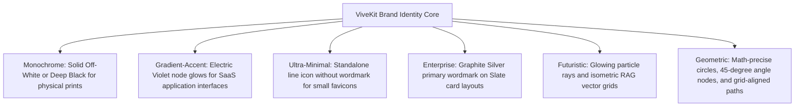

# ViveKit — Brand Identity System

> Last Updated: 2026-05-29

### The Unified AI-Powered Business Communication OS Design Manual

ViveKit is an **AI-powered business communication operating system** designed specifically for freelancers, agencies, and consultants. It leverages contextual vector memory and cognitive prompt routing to transform fragmented client conversations into structured, strategic business intelligence.

---

## 💎 1. Brand Essence & Personality

The ViveKit brand is positioned at the intersection of **Operational Excellence** and **Cognitive Intelligence**. It is designed to feel like a serious, enterprise-grade infrastructure platform, completely avoiding the playful, cartoonish aesthetic of generic customer support tools.

- **Intelligence**: Deep context awareness, structured RAG memory, and strategic precision.
- **Operational Calm**: Clean layouts and generous whitespace to reduce the cognitive "noise" of business communication.
- **Premium Minimalist**: Highly legible typography, low-contrast dark themes, and subtle neon indicators inspired by Linear, Stripe, and Vercel.

---

## 🎨 2. Visual Foundation (Design Tokens)

### The "Midnight & Neon" Color System

ViveKit’s interface utilizes a dark, high-end slate background with thin charcoal borders, high-contrast typography, and concentrated electric violet and cyan accents for system states.

| Swatch | Token Name          | Hex       | HSL                  | Primary Application                                  |
| :----- | :------------------ | :-------- | :------------------- | :--------------------------------------------------- |
| ⬛     | **Ink Black**       | `#02040a` | `hsl(224, 71%, 4%)`  | Global App background, page foundation               |
| 🌑     | **Slate Graphite**  | `#0f1115` | `hsl(220, 14%, 9%)`  | Primary UI surfaces, sidebars, cards                 |
| 🪨     | **Muted Charcoal**  | `#212328` | `hsl(225, 9%, 15%)`  | Card borders, interactive hover boundaries           |
| ⬜     | **Off-White Core**  | `#f8f9fa` | `hsl(210, 20%, 98%)` | Primary titles, heavy wordmarks, buttons             |
| 🌫️     | **Graphite Silver** | `#a0a5b0` | `hsl(220, 8%, 66%)`  | Secondary body text, subtle dashboard labels         |
| 🔮     | **Electric Violet** | `#7c3aed` | `hsl(263, 85%, 62%)` | AI status highlights, core brand accents             |
| 💎     | **Neon Cyan**       | `#06b6d4` | `hsl(189, 94%, 43%)` | RAG timeline nodes, success triggers, database ticks |

### Typography Stack

- **Primary System Font**: **Geist Sans**
  - _Characteristics_: Geometric, Swiss-inspired, highly legible neo-grotesque structure.
  - _Weight_: Light (300) for clean text; Semi-Bold (600) for layout headers.
  - _Tracking_: `-0.03em` on sizes above `24px` for tight modern startup headlines.
- **Secondary Technical Font**: **Geist Mono**
  - _Characteristics_: Monospace precision.
  - _Application_: RAG confidence parameters, system vector tokens, time stamps, and prompt variables.

---

## 📐 3. Required Deliverables & Visual Asset Inventory

The following assets represent our finalized startup branding assets, successfully configured and optimized inside the project’s `/public` folder:

### 1. Main Logo & Standalone App Icon

- **Horizontal Logo**: Abstract logo icon on the left, geometric wordmark on the right.
- **Standalone Icon**: A stylized, abstract "V" formed by two converging paths of differing weights, representing the integration of raw client dialogue streams with structured business memory.
- **App Icon**: Optimized super-ellipse (rounded-square) with a soft Electric Violet glow behind the central signal "V".

- **Standard Path**: `/public/logo.png`
- **Favicon**: Ultra-minimal single-stroke violet emblem optimized for `16x16` and `32x32` browser tabs.

---

### 2. Website Hero Visual

- **Concept**: "The Intelligence Loop." An isometric illustration showing raw client dialogue entering a crystalline "ViveKit" vector prism and emerging as structured, glowing business logic.

- **Standard Path**: `/public/hero.png`

---

### 3. Open Graph (OG) Social Image (1200x630)

- **Layout**: Centered ViveKit branding, clean typography, and a modern slate SaaS dashboard detailing mock charts and glowing connection nodes.

- **Standard Path**: `/public/og.png`

---

### 4. Twitter/X Header Banner (1500x500)

- **Composition**: Sleek horizontal banner showcasing abstract 3D signal flows spreading across deep graphite spacing.

- **Standard Path**: `/public/twitter-header.png`

---

## ⚡ 4. Creative Directions & Variations

To support scalable brand presence across printing press, banners, and digital platforms, the logo system implements six responsive modes:

---

## 🚫 5. Brand "Never" List

To maintain absolute professional credibility, the brand **must never** utilize:

- **NO** generic robot heads or humanoids (feels cheap and gimmicky).
- **NO** chat/speech bubbles (dilutes the platform into a basic support chat-widget).
- **NO** friendly blue/green gradients (associated with outdated Fintech).
- **NO** friendly, rounded, or handwriting typography (must communicate operational precision).
- **NO** clutter. High whitespace ratios are treated as ViveKit's primary visual asset.
